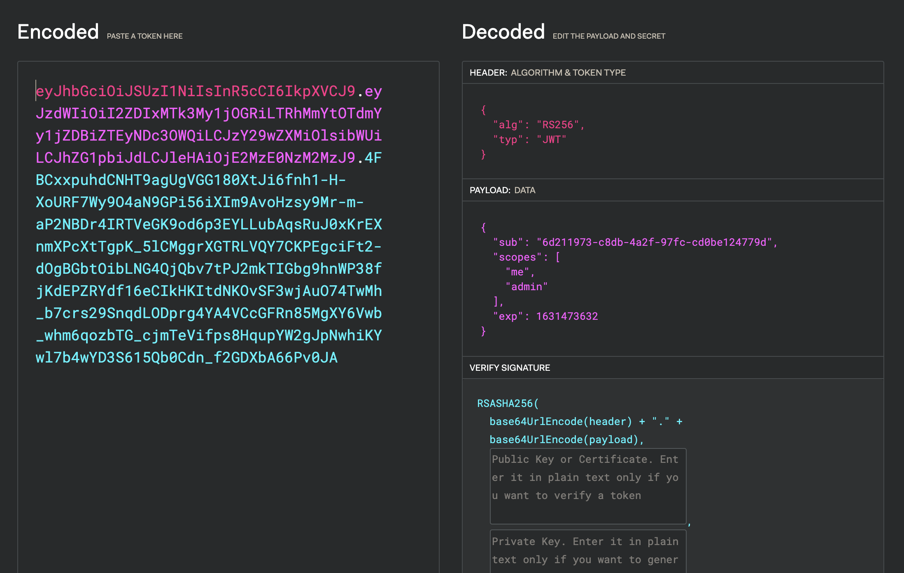

## @Environment

| Component | version                |
| --------- | ---------------------- |
| python    | 3.9.7                  |
| OS        | Windows, Mac OS, Linux |

**The project won't run with versions of python under 3.9 !**

---

## @Deployment

**Before running the project, you have to verify your configuration file in API/Config/parameters.py !!**

Parameters that should be adapt are :

- API_IP
- API_PORT
- DB_USER
- DB_PASS
- DB_IP
- DB_PORT

--

**Other parameters are available in the configuration file, feel free to change them for a more personnal usage of the API**

Then you can run the project

> With Python on **Linux** and **Mac OS**

    python3 -m pip install virtualenv
    virtualenv venv
    source venv/bin/activate
    python3 -m pip install -r requirements.txt
    python3 main.py

> With Python on **Windows**

    python3 -m pip install virtualenv
    python3 -m virtualenv venv
    venv\Scripts\activate
    python3 -m pip install -r requirements.txt
    python3 main.py

> As a **Docker** 

    docker build -t <IMAGE_NAME> .
    docker run -d --name <CONTAINER_NAME>  -p <LOCAL_PORT>:8000 <IMAGE_NAME>

> You can then reach the API on your browser

    https://<API_IP>:<API_PORT>/

---

## @Authentication & permissions

The authentication is mainly handled by the **Oauth2** standard and the usage of **JWTs**.

The majority of the methods that handle authentication originate from the documentation provided by FastAPI but others have been added or adapted.

e.g the modification of personal passwords, JWTs signature parameters, hash management and expiration times.
All those parameters can be adjusted, depending on your needs, in **config/parameters.py**.

### @Tokens

The structure of JWTs is the one represented in the following image.
The JWTs are signed with the RS256 algorithm which requires an asymmetric key pair, but patches the main weaknesses of HS256, the default algorithm.

**Tokens are not stored in the database because they are not used as reference tokens.**

---

## @Security Concerns

**Disclaimer: this project is ABSOLUTELY NOT production ready, don’t even think using this API in its current state in another usage than learning purpose, student projects or POC environments.**

The security of this application is currently rudimentary, but it still implements the following key considerations:

- Communications are encrypted with **HTTPS**.
- **CORS** prevents communications between the application and any undesired domains.
- **Trusted Hosts** prevent any undesired users from accessing the API.
- **Middleware** provides full incoming requests and responses treatments before they reach API endpoints. 
- **Allowed Methods** prevent undesired actions to reach the API. 
  
**If you consider using this project personally, don’t forget to change all keys according to the algorithms used. Do not store them in the app folder and change their path to a more secure folder e.g. on your server, your database or whatever secure environment !**
